# Enterprise Copilot

**Enterprise Copilot** is a self-hostable, multi-tenant AI workspace for teams to **search, chat (RAG), and summarize** business documents (PDF/DOCX/TXT) with **workspace isolation**, **async ingestion**, and **usage quotas**.

[](https://github.com/Zhanassy1/enterprise-copilot/actions/workflows/ci.yml)
[](https://www.python.org/downloads/)
[](https://nodejs.org/)
[](LICENSE)

### What’s implemented

- [x] **Multi-tenant workspaces** — isolation by `workspace_id`, slug routes `/w/:slug/…`, role-aware UI ([docs/product-glossary.md](docs/product-glossary.md))
- [x] **Documents + async ingestion** — upload API, Celery worker, job queue UI, pgvector chunks
- [x] **Search + RAG chat + summaries** — semantic retrieval with workspace scope and citations
- [x] **Plans + quotas** — tier limits, usage display, enforcement on hot paths ([docs/quotas.md](docs/quotas.md))
- [x] **Team + invitations** — invitations API, Team page (roles matrix, invites); members API ([docs/WORKSPACE_ROUTING.md](docs/WORKSPACE_ROUTING.md))
- [x] **Billing (optional)** — Stripe Checkout, Customer Portal, webhooks, grace period ([docs/billing.md](docs/billing.md))
- [x] **Security + ops** — JWT/refresh, rate limits, audit log, metrics, production startup checks ([docs/security.md](docs/security.md))

For maturity detail: [docs/IMPLEMENTATION_STATUS.md](docs/IMPLEMENTATION_STATUS.md). Contributing: [CONTRIBUTING.md](CONTRIBUTING.md).

### Tech stack

| Layer | Technology |
|-------|------------|
| API | **FastAPI** |
| Frontend | **Next.js** |
| Database | **PostgreSQL** + **pgvector** |
| Background jobs | **Celery** |
| Broker / cache | **Redis** |

### Quick start

```bash
git clone https://github.com/Zhanassy1/enterprise-copilot.git && cd enterprise-copilot
cp .env.example .env
docker compose up --build
```

Then open **http://localhost:3000** (UI) and **http://localhost:8000/docs** (API). Docker dev defaults: [backend/.env.docker](backend/.env.docker); for local backend env see [env/.env.example](env/.env.example) → `backend/.env`.

Если при `docker compose up` ошибка bind на порту **3000** (уже занят, например локальным Next): задайте другой хост-порт и откройте UI на нём — `HOST_FRONTEND_PORT=3001 docker compose up` (PowerShell: `$env:HOST_FRONTEND_PORT=3001; docker compose up`), затем **http://localhost:3001**.

### Enterprise (optional)

- **Invitations**: emails link to `{APP_BASE_URL}/invite/{token}` (legacy `?token=` redirects in the UI). Configure SMTP relay or `SENDGRID_API_KEY` (see `backend/.env.example`, `docs/email-testing.md`). Pending invites: Team UI and `/api/v1/workspaces/{id}/invitations`. After acceptance the invite token is cleared in the database. You can also pass `invite_token` on `POST /api/v1/auth/login` or `POST /api/v1/auth/register` (register with an invite returns JWT like `/invitations/accept`; password min. 8 characters in that path).
- **Stripe**: `STRIPE_SECRET_KEY`, `STRIPE_WEBHOOK_SECRET`, `STRIPE_PRICE_ID` (Pro default), optional `STRIPE_PRICE_ID_PRO` / `STRIPE_PRICE_ID_TEAM` for explicit Price ids; webhook `POST /api/v1/billing/webhooks/stripe` updates the workspace `WorkspaceQuota` row (plan, Stripe ids, status, renewal/grace). Grace after failed payment: `BILLING_GRACE_PERIOD_DAYS` (default 3). Customer Portal and Checkout from the Billing page (owner/admin); `POST /api/v1/billing/checkout` accepts `plan_slug` `pro` or `team`.
- **Platform admin**: database flag `users.is_platform_admin` and/or `PLATFORM_ADMIN_EMAILS` (comma-separated). API: `/api/v1/admin/…` (impersonation, usage, quota adjust). UI: `/admin`. Do not commit real addresses — set them only in local/private env (e.g. uncomment and fill `PLATFORM_ADMIN_EMAILS` in your copy of `backend/.env.docker`).

**Docker / Next.js:** если UI отдаёт 500/404 или `Cannot find module './…js'`, очистите кэш и перезапустите фронт: `docker compose exec frontend rm -rf /app/.next && docker compose restart frontend` (на хосте можно удалить `frontend/.next`).

### Architecture

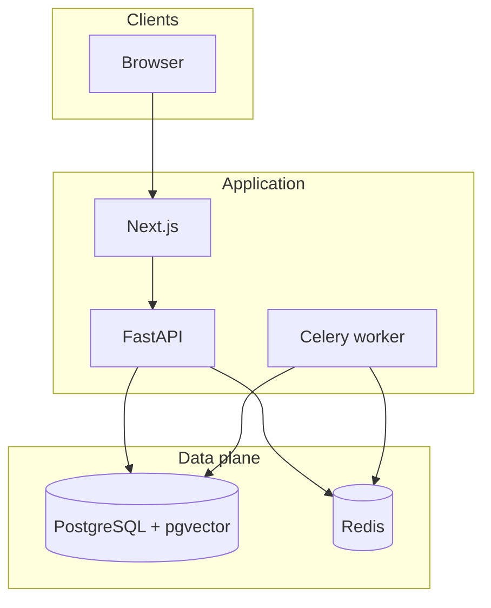

Upload and search requests hit **FastAPI**; **Celery** consumes **Redis** and writes chunks/embeddings to **PostgreSQL/pgvector**. Details: [docs/architecture.md](docs/architecture.md).

**Product boundaries (team vs billing):** both layers share **authN + workspace scope** (`X-Workspace-Id`, [`backend/app/api/deps.py`](backend/app/api/deps.py)). **Team** flows use workspaces, invitations, and member APIs ([`backend/app/api/routers/invitations.py`](backend/app/api/routers/invitations.py), [`backend/app/api/routers/workspace_members.py`](backend/app/api/routers/workspace_members.py)). **Billing** uses Stripe Checkout/Portal and webhooks to update plan/subscription state, which feeds **quota checks** on uploads and RAG routes ([`backend/app/api/routers/billing.py`](backend/app/api/routers/billing.py)).

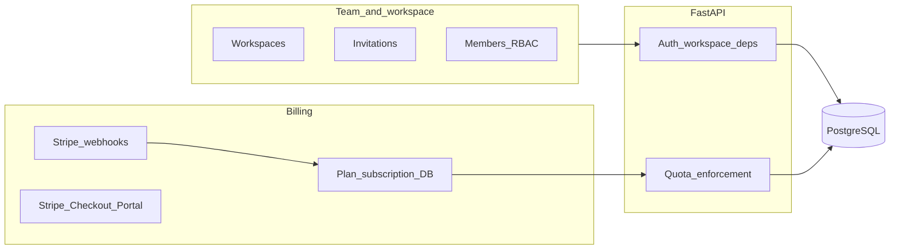

### Screenshots

| Landing | Pricing | Documents |
|:-------:|:-------:|:---------:|
| 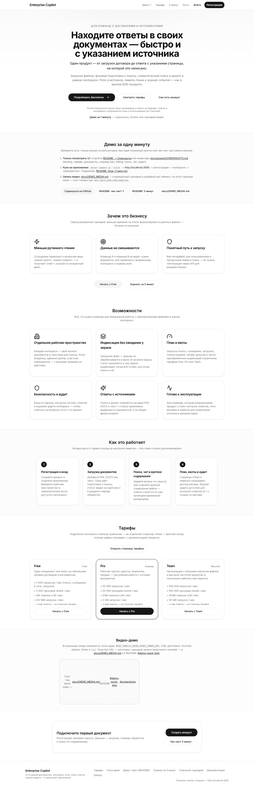 | 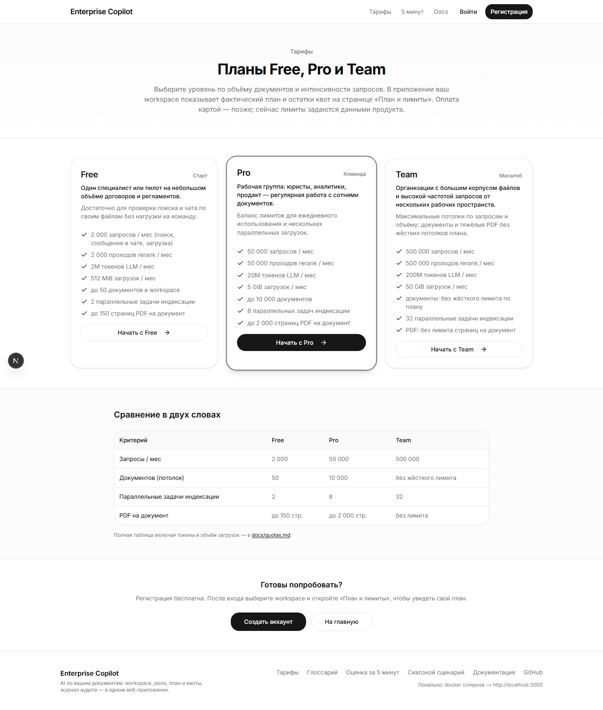 | 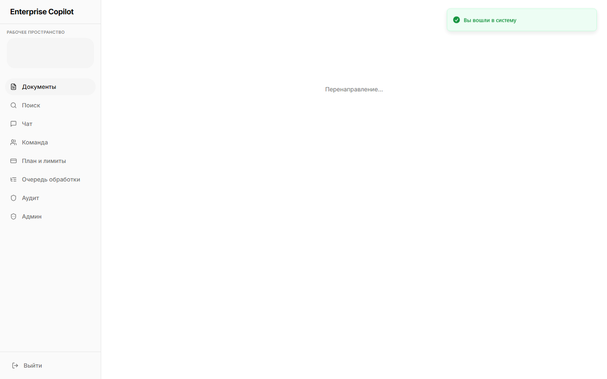 |

| Jobs | Billing | Team |
|:----:|:-------:|:----:|
| 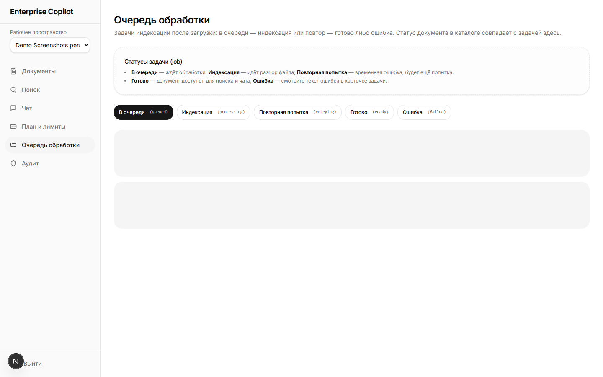 | 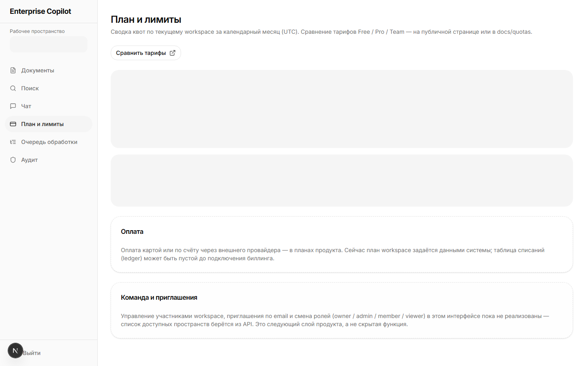 | 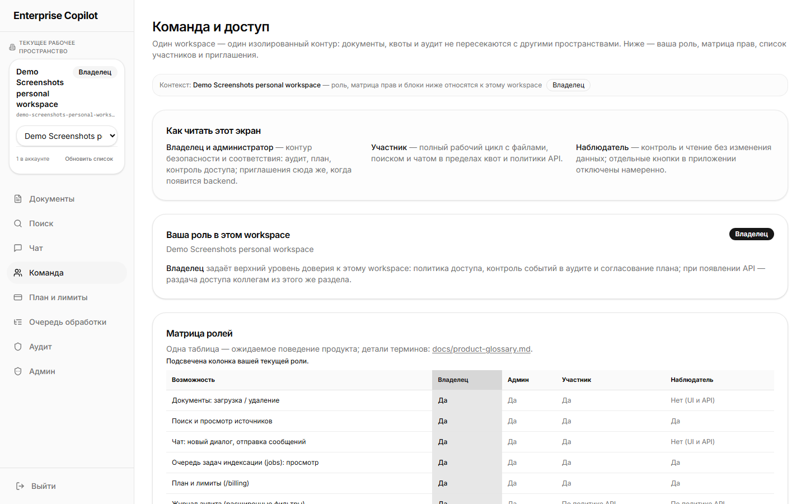 |

| Search | Chat | Audit |
|:------:|:----:|:-----:|
| 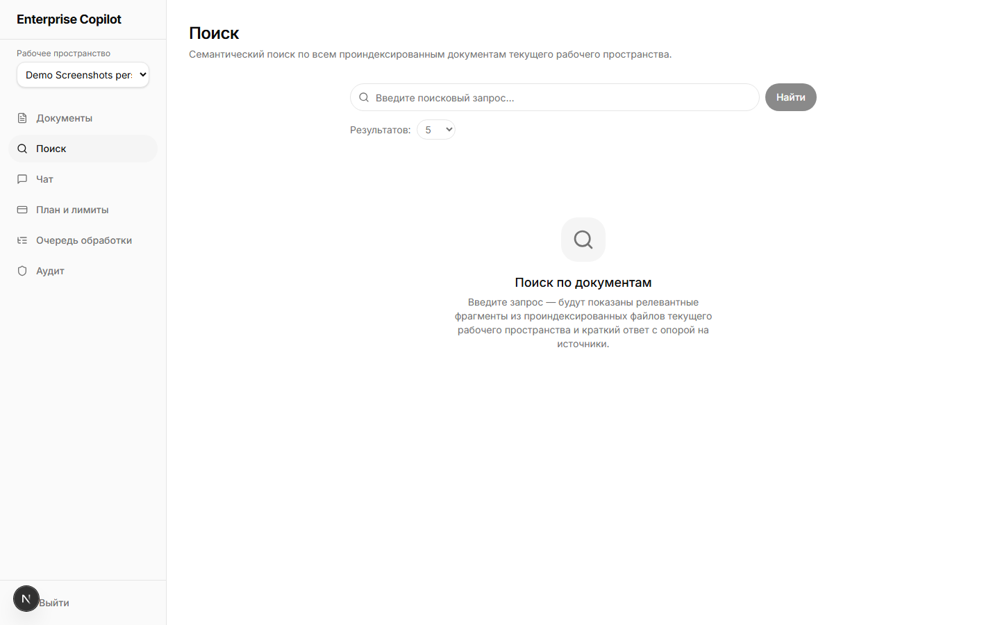 | 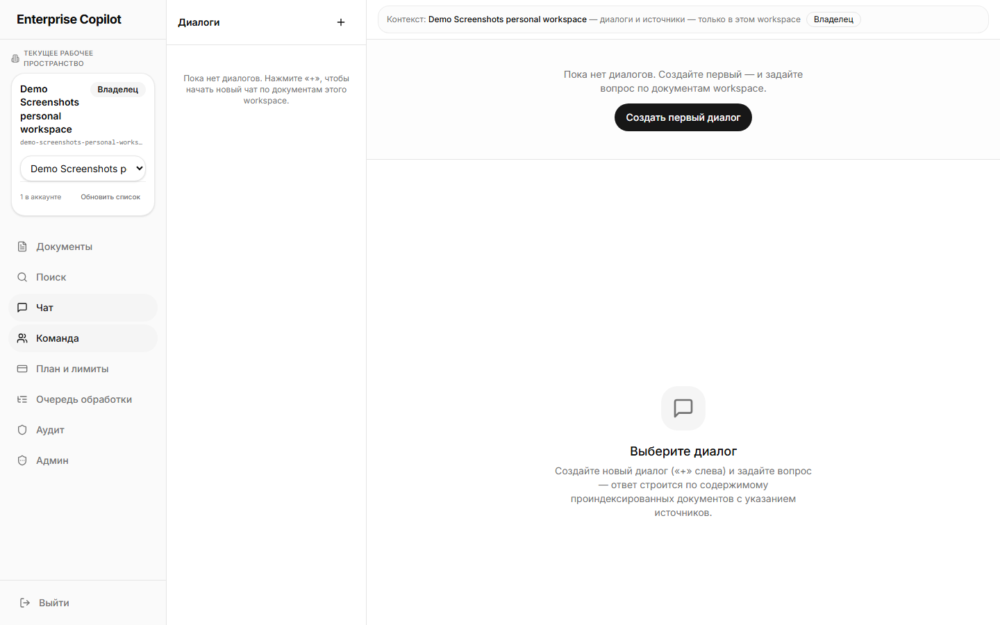 | 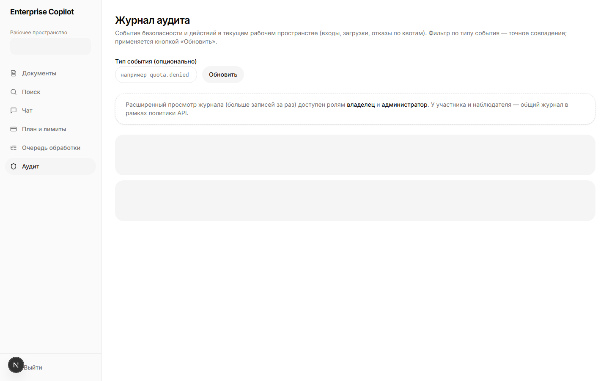 |

Motion demo: embed a walkthrough via [docs/DEMO_MEDIA.md](docs/DEMO_MEDIA.md) (`NEXT_PUBLIC_DEMO_VIDEO_EMBED_URL` on the landing page). Caption index and Playwright capture: [Documentation (RU) — Скриншоты](#screenshots) · [docs/assets/SCREENSHOTS.md](docs/assets/SCREENSHOTS.md).

---

## Documentation (RU)

**Multi-tenant AI copilot для бизнес-документов:** семантический поиск, RAG-чат и краткие summary по PDF/DOCX/TXT с **изоляцией по рабочим пространствам (workspace)**, **фоновой индексацией** (Celery + PostgreSQL/pgvector), **планом и квотами** и **журналом аудита**.

Репозиторий: [github.com/Zhanassy1/enterprise-copilot](https://github.com/Zhanassy1/enterprise-copilot)

**Это SaaS?** Да: **многоарендный B2B-продукт** с полным **веб-интерфейсом** и **API**, **рабочими пространствами (workspace)**, ролями и квотами. Вы разворачиваете у себя (Docker / облако) и управляете данными и доступом — без обязательного публичного shared-хостинга. Единая терминология: **[docs/product-glossary.md](docs/product-glossary.md)**.

<a id="demo-quick-1min"></a>

### Демо за 1 минуту

| Скорость | Что сделать |
|----------|-------------|
| **~20 сек** | Прокрутить [скриншоты](#screenshots) или открыть [docs/assets/SCREENSHOTS.md](docs/assets/SCREENSHOTS.md) — landing, `/pricing`, документы, jobs, billing, команда, поиск, чат, аудит. |
| **~1 мин** | Поднять стек `docker compose up --build`, открыть **http://localhost:3000**, на маркетинговой главной — блок **«Демо за одну минуту»** (`/#demo-quick-1min`), затем **Регистрация** → приложение → **workspace** в переключателе → **Документы**. |
| **Видео** | Сценарий записи и таймкоды: **[docs/DEMO_MEDIA.md](docs/DEMO_MEDIA.md#demo-quick-1min)**; встроенный плеер на главной при `NEXT_PUBLIC_DEMO_VIDEO_EMBED_URL` — см. [#demo-video](#demo-video). |

Расширенный чек-лист: [#evaluator-five-minutes](#evaluator-five-minutes).

---

## Что это и для кого

| | |
|--|--|
| **Продукт** | Платформа для команд, которым нужно быстро находить факты в договорах, политиках и отчётах, не читая сотни страниц вручную. |
| **Для кого** | Компании и продуктовые команды, которые готовы к self-hosted или облачному развёртыванию с контролем данных и лимитов. |
| **Проблемы** | Долгий поиск в документах, разрозненные файлы, ответы без привязки к источнику — закрываются поиском и чатом с цитатами, границами workspace и статусами обработки. |

### Ключевые возможности

- [x] **Рабочие пространства и роли** — изоляция данных, slug-маршруты `/w/:slug/…`, матрица прав на странице «Команда».
- [x] **Индексация и очередь** — загрузка, Celery, `/jobs`, pgvector.
- [x] **Поиск, чат, summary** — RAG с источниками в границах workspace.
- [x] **План и квоты** — лимиты тарифа, учёт usage, enforcement на API.
- [x] **Приглашения и биллинг (опционально)** — цепочка invite, Stripe при настроенных ключах.

- **Multi-tenant AI copilot** — данные и векторный индекс разделены по **рабочим пространствам (workspace)**; роли: **владелец / администратор / участник / наблюдатель** (в API: owner / admin / member / viewer). См. [глоссарий](docs/product-glossary.md).
- **Асинхронная индексация** — после загрузки создаётся **задача индексации** (ingestion job); обработка в **worker**, не в HTTP-запросе. Статусы: **queued → processing / retrying → ready | failed** у документа и задачи.
- **Изоляция** — API и worker привязаны к `workspace_id`; клиент передаёт **`X-Workspace-Id`**.
- **План и квоты** — лимиты запросов, токенов LLM, загрузок, параллельных задач индексации и страниц PDF по тарифу **free / pro / team**; см. [docs/quotas.md](docs/quotas.md).
- **Auth / security lifecycle** — JWT, refresh rotation, logout / logout-all, password reset с revoke refresh, failed-login audit, production **startup_checks**.
- **Эксплуатация** — логи, идентификатор запроса, метрики, опционально Sentry; памятка для операторов — [docs/runbook.md](docs/runbook.md), [docs/observability.md](docs/observability.md).

### Платформенный блок (одним абзацем)

**Enterprise Copilot** — готовое **веб-приложение** для командной работы с документами: маркетинговая главная и **`/pricing`**, приложение с **переключателем рабочего пространства (workspace)** и бейджем роли, **«Команда и доступ»** (матрица прав; каталог участников и email-приглашения подключаются расширением API), **документы**, **поиск**, **чат**, **«План и лимиты»** (`/billing` с расходом квот), **очередь индексации** и **журнал аудита**. Картой лимитов служит **[docs/quotas.md](docs/quotas.md)**. Онлайн-оплата через внешнего провайдера и self-service смена тарифа в один клик запланированы как следующий слой; **текущий план и usage уже отражаются в UI и API**.

---

<a id="evaluator-five-minutes"></a>

## Быстрая оценка за 5 минут (evaluator guide)

**За эти пять минут вы проходите тот же путь, что и пользователь продукта:** от маркетинга до поиска по своему файлу и контроля квот.

1. `docker compose up --build` — открыть **http://localhost:3000** (главная для гостей), при желании пролистать **http://localhost:3000/pricing**; затем **Регистрация** → **Вход**.
2. Убедиться, что выбрано **рабочее пространство** (переключатель в боковой панели); при первом входе подставляется доступное пространство из API.
3. **Документы** → загрузить PDF/DOCX; открыть **Очередь обработки** — увидеть задачу индексации в статусе «В очереди» / «Индексация», затем «Готово».
4. **Поиск** или **Чат** — задать вопрос по содержимому; проверить источники в ответе.
5. **План и лимиты** — план рабочего пространства и счётчики месяца; **Аудит** — события (при наличии действий); при необходимости сравнить лимиты с [docs/quotas.md](docs/quotas.md).

| Дальше | Ссылка |
|--------|--------|
| Скриншоты UI (без запуска) | [#screenshots](#screenshots) · [docs/assets/SCREENSHOTS.md](docs/assets/SCREENSHOTS.md) |
| Демо за 1 минуту | [#demo-quick-1min](#demo-quick-1min) · маркетинговая главная `/#demo-quick-1min` |
| Запись / спикер | [docs/DEMO_MEDIA.md](docs/DEMO_MEDIA.md) (блок 1 мин и ~4 мин) |

**Визуально по шагам:** готовые кадры в [docs/assets/screenshots/](docs/assets/screenshots/). Развёрнутый голосовой сценарий: [docs/DEMO_MEDIA.md#demo-script-4min](docs/DEMO_MEDIA.md#demo-script-4min). Тот же порядок шагов в доке: [Оценка за 5 минут в DEMO_MEDIA](docs/DEMO_MEDIA.md#evaluator-walkthrough).

---

<a id="product-flow"></a>

## Демо-сценарий (сквозной flow)

| Шаг | Действие |
|-----|----------|
| 1 | Регистрация и вход |
| 2 | Выбор **рабочего пространства** (список из API; самостоятельное создание новых — в roadmap) |
| 3 | Загрузка документа |
| 4 | **Асинхронная обработка** — job в UI и статус на карточке документа |
| 5 | Поиск, чат, summary по документу |
| 6 | Квоты и безопасность — лимиты на странице плана; аудит; ops — логи и метрики по [docs/observability.md](docs/observability.md) |

Три компактных сценария (invite, upgrade, upload→job): **[docs/DEMO_MEDIA.md#product-demo-flows](docs/DEMO_MEDIA.md#product-demo-flows)**. В UI на `/w/:slug/…` — сворачиваемый блок «Быстрые сценарии» (см. тот же якорь).

---

<a id="demo-video"></a>

## Демо-видео

Готовый ролик — самый быстрый способ показать продукт команде, которая не поднимает Docker.

- Сценарий записи и таймкоды: **[docs/DEMO_MEDIA.md](docs/DEMO_MEDIA.md)**.
- **Встроить на маркетинговую главную:** задайте **`NEXT_PUBLIC_DEMO_VIDEO_EMBED_URL`** (полный URL iframe, например YouTube `https://www.youtube.com/embed/VIDEO_ID`) — блок «Видео-демо» подменится плеером.
- **В README без деплоя:** скопируйте блок iframe ниже и подставьте свой embed URL (тот же, что и для env).

```html
<!-- Demo video embed placeholder — замените VIDEO_ID -->
<iframe width="560" height="315" src="https://www.youtube.com/embed/VIDEO_ID" title="Enterprise Copilot demo" allow="fullscreen" allowfullscreen></iframe>
```

<a id="screenshots"></a>

## Скриншоты

Ниже — **один визуальный проход** по продукту (готово для README, презентаций и due diligence). Источник файлов: **`docs/assets/screenshots/`**. Автосъёмка: Playwright **`frontend/e2e/demo-screenshots.spec.ts`**; команда `cd frontend && npm run demo:screenshots` (нужны UI + API; кадр **summary** и документ «Готово» — с **`DEMO_SCREENSHOTS_WITH_INGEST=1`** и worker, см. **[docs/assets/SCREENSHOTS.md](docs/assets/SCREENSHOTS.md)**).

| Кадр | Файл | Что демонстрирует |
|------|------|-------------------|
| Маркетинг | `landing.png` | Ценность, тарифы на главной, CTA, блок демо |
| Тарифы | `pricing.png` | Free / Pro / Team, сравнение лимитов |
| Документы | `documents.png` | Каталог workspace, статусы индексации |
| Очередь | `jobs.png` | Задачи индексации по статусам |
| План и лимиты | `billing.png` | Текущий план, расход квот |
| Команда | `team.png` | `/w/…/team` — роли, участники, приглашения |
| Поиск | `search.png` | Семантический поиск в границах workspace |
| Чат | `chat.png` | RAG-диалог с источниками |
| Аудит | `audit.png` | Журнал событий workspace |

| Landing | Pricing | Documents |
|:-------:|:-------:|:---------:|
|  |  |  |

| Jobs | Billing | Team |
|:----:|:-------:|:----:|
|  |  |  |

| Search | Chat | Audit |
|:------:|:----:|:-----:|
|  |  |  |

<a id="demo-script"></a>

## Демо (сценарий 3–5 минут)

Коротко (1 мин): **[docs/DEMO_MEDIA.md#demo-quick-1min](docs/DEMO_MEDIA.md#demo-quick-1min)**. Развёрнутый сценарий записи: **[docs/DEMO_MEDIA.md — ~4 мин](docs/DEMO_MEDIA.md#demo-script-4min)** (login → workspace → upload → очередь → поиск → чат → summary → план/usage → аудит). Таблица «Демо-сценарий» выше — краткая версия того же flow.

---

## Текущие возможности и ограничения

| Состояние | Что имеется в виду |
|-----------|---------------------|
| **Работает** | Auth, workspace scope, upload, async ingestion, поиск и чат с источниками, summary, квоты, rate limits по плану, audit API + UI, отображение плана и расхода в **«План и лимиты»** (интеграция со Stripe/инвойсами — отдельная веха). |
| **Production stack** | Compose dev/prod overlay, startup checks, метрики, runbook, S3; при корректных секретах и worker готово к эксплуатации у заказчика. |
| **Следующие вехи** | Внешний биллинг и **API приглашений** в workspace; до их появления экран **«Команда и доступ»** показывает матрицу прав и UI, готовый к данным API. **Наблюдатель (viewer):** запись в документы и активный чат отключены в UI; политика совпадает с API. Детали: [docs/IMPLEMENTATION_STATUS.md](docs/IMPLEMENTATION_STATUS.md). |

### Roadmap (кратко)

| Горизонт | Направления |
|----------|-------------|
| **Near-term** | Внешний биллинг, API и UI **приглашений** в workspace, расширение e2e Playwright. |
| **Long-term** | SSO, расширенный admin tenant, сравнение документов, расширенная аналитика. |

Детализация по шагам зрелости: **[docs/IMPLEMENTATION_STATUS.md](docs/IMPLEMENTATION_STATUS.md)**.

---

## Архитектура (кратко)

| Слой | Технологии |
|------|------------|
| API | FastAPI, JWT, workspace dependencies |
| Worker | Celery, очередь `ingestion`, retry/backoff |
| DB | PostgreSQL + **pgvector** |
| Queue | Redis (broker Celery) |
| Storage | `local` (dev) или **S3** / MinIO |
| Frontend | Next.js (landing + приложение) |

**Асинхронный ingestion:** `POST /api/v1/documents/upload` сохраняет файл, создаёт `Document` и `IngestionJob`, **коммитит**, затем `ingest_document_task.apply_async` ([`document_ingestion.py`](backend/app/services/document_ingestion.py)). Векторы пишет worker ([`document_indexing.py`](backend/app/services/document_indexing.py), [`tasks/ingestion.py`](backend/app/tasks/ingestion.py)). В **production** синхронная индексация в HTTP запрещена (`startup_checks`).

Инвентарь tenant-scope: **[docs/WORKSPACE_ROUTING.md](docs/WORKSPACE_ROUTING.md)**. Обзор компонентов: **[docs/architecture.md](docs/architecture.md)**.

---

## Dev setup

```bash
docker compose up --build
```

| Сервис | URL |
|--------|-----|
| UI | http://localhost:3000 |
| API | http://localhost:8000 |
| OpenAPI | http://localhost:8000/docs |
| Health | http://localhost:8000/healthz |

Шаблоны env: [env/.env.example](env/.env.example) → `backend/.env`; для контейнеров: [backend/.env.docker](backend/.env.docker).

**Без Docker:** в `backend/` — venv, `pip install -r requirements.txt`, `alembic upgrade head`, `uvicorn app.main:app --reload`; в `frontend/` — `npm install`, `npm run dev`.

`docker-compose.yml` **публикует** порты Postgres (5433) и Redis (6380) на хост для разработки — **не** как модель публичного production.

---

## Production setup

```bash
docker compose -f docker-compose.yml -f docker-compose.prod.yml up -d --build
```

Подробности: **[docs/deployment.md](docs/deployment.md)**. Шаблон: **[.env.production.example](.env.production.example)**.

Старт с `ENVIRONMENT=production` и небезопасным конфигом **блокируется** ([`startup_checks.py`](backend/app/core/startup_checks.py)).

### Production checklist

| Область | Действие |
|---------|----------|
| Secrets | `SECRET_KEY` (не default), креды БД/Redis/S3 из secrets manager |
| Database | `DATABASE_URL` с TLS (`?sslmode=require` и т.д.) по умолчанию в prod; не `localhost` / не `postgres:postgres`; `PRODUCTION_REQUIRE_DATABASE_SSL=0` только для внутренней БД без TLS |
| Redis | Пароль в URL или `rediss://`; см. startup checks |
| Storage | По умолчанию в prod требуется `STORAGE_BACKEND=s3` и ключи; `PRODUCTION_REQUIRE_S3_BACKEND=0` только осознанно (staging / compose без MinIO) |
| Reverse proxy | TLS termination; `USE_FORWARDED_HEADERS` + `TRUSTED_PROXY_IPS`; по умолчанию в prod `TRUSTED_PROXY_IPS` должен быть задан |
| CORS | Явный `CORS_ORIGINS` в prod (regex для приватных сетей отключён); в `docker-compose.prod.yml` задаётся через env |
| Health | `/healthz`, `/readyz` за балансировщиком |
| Migrations | **migrate:** одноразовый сервис в `docker compose` (`alembic upgrade head`); без compose — выполнить миграции вручную до старта API |
| Worker | Celery worker с той же `REDIS_URL` и очередью `ingestion` |
| Sentry / metrics | `SENTRY_DSN` опционально; `/metrics` при `observability_metrics_enabled` |

---

## Документация

| Документ | Содержание |
|----------|------------|
| [CONTRIBUTING.md](CONTRIBUTING.md) | Как вносить изменения, проверки CI, безопасность |
| [docs/deployment.md](docs/deployment.md) | Dev vs prod compose, TLS, S3/MinIO, миграции |
| [docs/security.md](docs/security.md) | Секреты, proxy, rate limits, audit |
| [docs/quotas.md](docs/quotas.md) | Планы free/pro/team, enforcement, 429 |
| [docs/observability.md](docs/observability.md) | Логи, Sentry, `/metrics` |
| [docs/runbook.md](docs/runbook.md) | Инциденты, backup, очередь |
| [docs/storage-lifecycle.md](docs/storage-lifecycle.md) | Объекты, retention, дедуп |
| [docs/email-testing.md](docs/email-testing.md) | SMTP, capture, e2e |
| [docs/testing-database.md](docs/testing-database.md) | NullPool, интеграционные тесты |
| [docs/IMPLEMENTATION_STATUS.md](docs/IMPLEMENTATION_STATUS.md) | Зрелость и roadmap |
| [docs/product-glossary.md](docs/product-glossary.md) | Workspace, роли, план, задача индексации |
| [docs/DEMO_MEDIA.md](docs/DEMO_MEDIA.md) | Видео-демо и материалы презентации |
| [docs/assets/SCREENSHOTS.md](docs/assets/SCREENSHOTS.md) | План скриншотов для README |
| [docs/WORKSPACE_ROUTING.md](docs/WORKSPACE_ROUTING.md) | API / Celery по workspace |

Шаблоны env: [.env.example](.env.example), [env/.env.example](env/.env.example), [backend/.env.example](backend/.env.example), [.env.production.example](.env.production.example).

---

## Testing

| Режим | Команда / условие |
|-------|-------------------|
| Unit (без Postgres) | `cd backend && python -m unittest discover -s tests -v` — интеграционные тесты *skipped* |
| Integration | `RUN_INTEGRATION_TESTS=1` + `DATABASE_URL` на Postgres; опционально `SQLALCHEMY_USE_NULLPOOL=1` — см. [docs/testing-database.md](docs/testing-database.md) |
| Async smoke | Job **backend-async-smoke** в [.github/workflows/ci.yml](.github/workflows/ci.yml); локально `RUN_ASYNC_PIPELINE_SMOKE=1` |
| Email HTTP e2e | `tests/test_email_e2e_flow.py` при `RUN_INTEGRATION_TESTS=1` — [docs/email-testing.md](docs/email-testing.md) |

Windows: [scripts/test-integration.ps1](scripts/test-integration.ps1).

При `RUN_INTEGRATION_TESTS=1` отключаются in-memory rate limits для auth в middleware ([`backend/app/middleware/rate_limit.py`](backend/app/middleware/rate_limit.py)).

```bash
cd frontend && npm run lint && npm run build
```

---

## Структура репозитория

```text
enterprise-copilot/
├── backend/           # FastAPI, Celery, Alembic, tests
├── frontend/          # Next.js (landing + app)
├── docs/
├── docker-compose.yml
├── docker-compose.prod.yml
└── README.md
```

`docker compose down` — остановка dev-стека.
